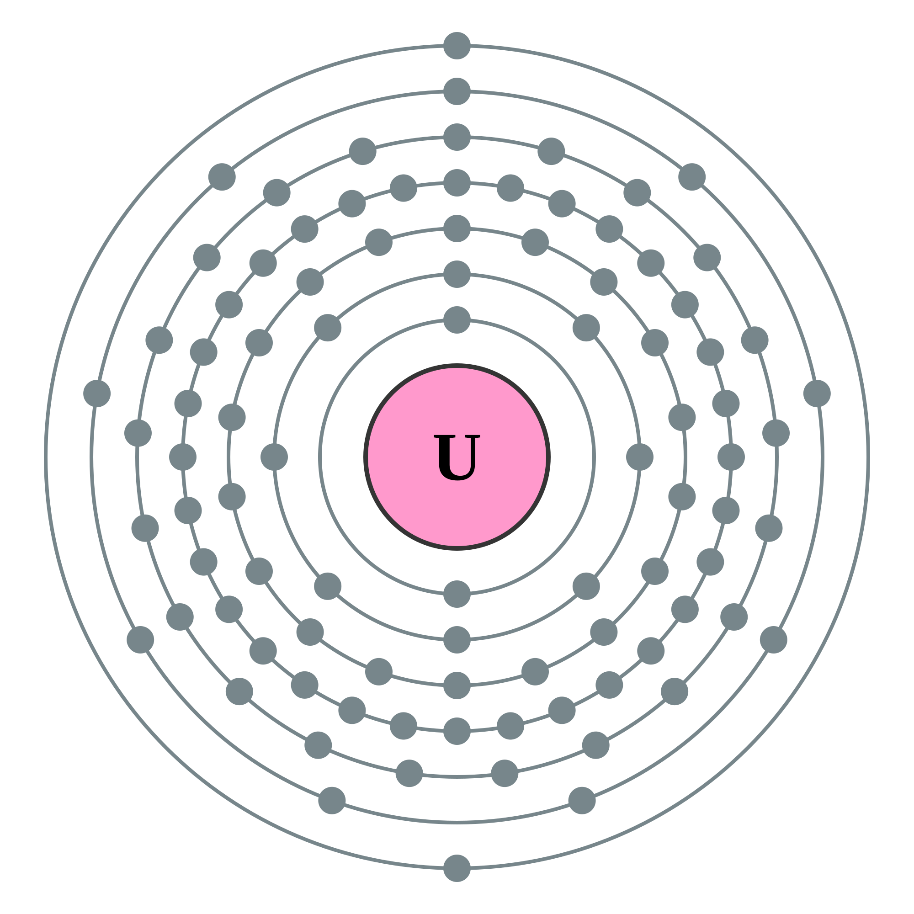

<div align="center">

</div>

# Uranium

a Luau bytecode disassembler/decompiler

## Quick Start

Download releases

- Luau compiled ( using wasm and spider )
- CLI
- Archive

## Build

Setup

```bash
brew install cmake ninja
```

Build

```bash
cmake --build build --target uranium -j 4
./build/uranium
```

## Abstract

IR -> CFG ->SSA -> AST

Logo author: commons:User:Pumbaa (original work by commons:User:Greg Robson) - http://commons.wikimedia.org/wiki/Category:Electron_shell_diagrams (corresponding labeled version), CC BY-SA 2.0 uk, https://commons.wikimedia.org/w/index.php?curid=22302376
